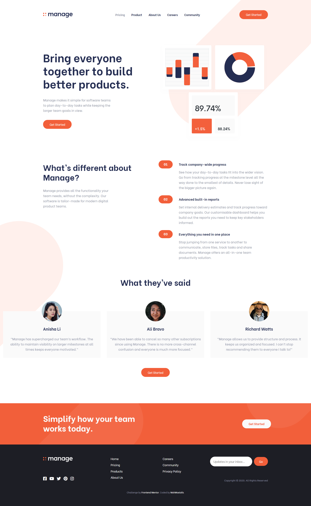
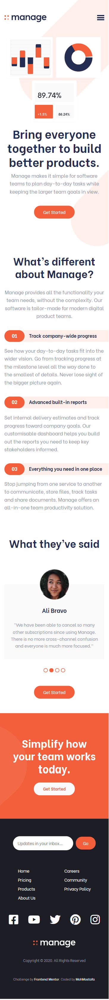
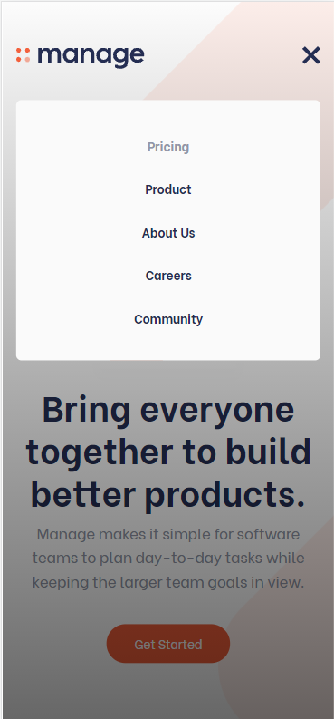

# Frontend Mentor - Manage landing page solution

This is a solution to the [Manage landing page challenge on Frontend Mentor](https://www.frontendmentor.io/challenges/manage-landing-page-SLXqC6P5). Frontend Mentor challenges help you improve your coding skills by building realistic projects. 

## Table of contents

- [Overview](#overview)
  - [The challenge](#the-challenge)
  - [Screenshot](#screenshot)
  - [Links](#links)
- [My process](#my-process)
  - [Built with](#built-with)
  - [What I learned](#what-i-learned)
  - [Continued development](#continued-development)
  - [Useful resources](#useful-resources)
- [Author](#author)

## Overview

### The challenge

Users should be able to:

- View the optimal layout for the site depending on their device's screen size
- See hover states for all interactive elements on the page
- See all testimonials in a horizontal slider
- Receive an error message when the newsletter sign up `form` is submitted if:
  - The `input` field is empty
  - The email address is not formatted correctly

### Screenshot





### Links

- Solution URL: [Manage Landing Page Frontend Mentor Solution](https://github.com/MohMostafa-Web/manage-landing-page-frontend-mentor)
- Live Site URL: [Manage Landing Page Live Site](https://mohmostafa-web.github.io/manage-landing-page-frontend-mentor/)

## My process

### Built with

- Semantic HTML5 markup
- Sass custom properties [Varaibles, Mixins , Media Queries, Components]
- [Bootstrap v4.6](https://getbootstrap.com/docs/4.6/getting-started/introduction/) - CSS and JS Plugins library
- [Slick Slider](https://kenwheeler.github.io/slick/) - jQuery Plugin
- jQuery

### What I learned

- use Boostrap grid, text flex Classes, see code below:

```html
<!-- Start Footer Section -->
  <footer class="text-center text-lg-left">
    <div class="container">
      <div class="row">
        <div class="social col-lg-3 order-3 order-lg-1">
          <div class="row flex-column">
            <div class="logo col-12 col-lg order-2 order-lg-1">
              <svg xmlns="http://www.w3.org/2000/svg" width="146" height="24"><g fill="none" fill-rule="evenodd"><path fill="#242D52" fill-rule="nonzero" d="M40.014 16.809V8.553c0-1.577.366-2.82 1.098-3.73.733-.91 1.65-1.365 2.75-1.365 2.158 0 3.237 1.577 3.237 4.731v8.62h3.782v-9.58c0-2.415-.5-4.22-1.503-5.417C48.376.615 46.945.017 45.084.017c-1.222 0-2.34.234-3.352.703a6.833 6.833 0 00-2.56 2.043h-.066C38.126.932 36.486.017 34.184.017c-.969 0-1.902.217-2.799.653a6.976 6.976 0 00-2.353 1.878h-.05V.265H25.2v16.527h3.782V8.553c0-1.577.372-2.82 1.115-3.73.743-.91 1.693-1.365 2.849-1.365 2.19 0 3.286 1.577 3.286 4.731v8.62h3.782zm21.101.248c2.246 0 3.997-.827 5.252-2.482h.05v2.217h3.616V.265h-3.782V2.25h-.066C64.93.761 63.23.017 61.082.017a7.76 7.76 0 00-5.681 2.415c-.705.75-1.26 1.66-1.668 2.73a9.589 9.589 0 00-.611 3.44c0 1.258.203 2.416.61 3.475.408 1.059.964 1.952 1.669 2.68a7.348 7.348 0 002.535 1.696 8.325 8.325 0 003.18.604zm.595-3.441c-1.399 0-2.538-.466-3.419-1.398-.88-.932-1.321-2.132-1.321-3.599 0-1.555.454-2.804 1.362-3.747.909-.943 2.04-1.414 3.394-1.414 1.343 0 2.458.493 3.345 1.48.886.988 1.33 2.215 1.33 3.681 0 1.467-.455 2.667-1.363 3.599-.909.932-2.018 1.398-3.328 1.398zm27.112 3.193V7.064c0-2.393-.536-4.166-1.61-5.319C86.14.593 84.655.017 82.762.017a7.373 7.373 0 00-3.056.645 6.958 6.958 0 00-2.477 1.87h-.05V.264h-3.782v16.527h3.782V8.487c0-1.588.388-2.823 1.164-3.706.777-.882 1.814-1.323 3.113-1.323.595 0 1.104.077 1.528.231.424.155.796.406 1.115.753.32.348.556.819.71 1.415.154.595.231 1.323.231 2.183v8.769h3.782zm10.218.248c2.246 0 3.996-.827 5.252-2.482h.05v2.217h3.616V.265h-3.782V2.25h-.066C102.855.761 101.154.017 99.007.017a7.76 7.76 0 00-5.682 2.415c-.704.75-1.26 1.66-1.668 2.73a9.589 9.589 0 00-.61 3.44c0 1.258.203 2.416.61 3.475.408 1.059.964 1.952 1.668 2.68a7.348 7.348 0 002.536 1.696 8.325 8.325 0 003.179.604zm.594-3.441c-1.398 0-2.538-.466-3.418-1.398-.881-.932-1.322-2.132-1.322-3.599 0-1.555.455-2.804 1.363-3.747.908-.943 2.04-1.414 3.394-1.414 1.343 0 2.458.493 3.344 1.48.886.988 1.33 2.215 1.33 3.681 0 1.467-.455 2.667-1.363 3.599-.908.932-2.018 1.398-3.328 1.398zm19.07 10.125c1.2 0 2.274-.14 3.22-.422.947-.281 1.743-.673 2.387-1.175a6.385 6.385 0 001.602-1.844 8.14 8.14 0 00.916-2.383c.188-.86.281-1.803.281-2.829V.265h-3.782v1.737h-.066a7.059 7.059 0 00-2.353-1.49A7.62 7.62 0 00118.142 0c-1.508 0-2.862.358-4.062 1.075-1.2.717-2.134 1.713-2.8 2.987-.666 1.273-.999 2.705-.999 4.293 0 1.61.35 3.038 1.049 4.285.699 1.246 1.66 2.203 2.882 2.87 1.222.667 2.598 1.001 4.129 1.001 2.047 0 3.716-.673 5.004-2.018h.066v1.753c0 1.17-.43 2.14-1.288 2.912-.86.772-2.07 1.158-3.634 1.158-1.068 0-2.006-.132-2.816-.397-.809-.265-1.742-.678-2.799-1.24l-.892 3.341c.925.552 1.966.976 3.122 1.274 1.156.298 2.356.447 3.6.447zm.132-10.72c-1.365 0-2.491-.434-3.377-1.3-.887-.865-1.33-2.026-1.33-3.482 0-1.4.435-2.542 1.305-3.425.87-.882 2.004-1.323 3.402-1.323 1.332 0 2.442.435 3.328 1.307.886.871 1.33 2.002 1.33 3.391 0 1.401-.433 2.556-1.297 3.466-.864.91-1.985 1.365-3.361 1.365zm19.086 4.036c1.542 0 2.899-.281 4.071-.844 1.173-.562 2.133-1.323 2.882-2.283l-2.642-2.266c-1.035 1.301-2.406 1.952-4.113 1.952-1.21 0-2.237-.337-3.08-1.01-.842-.672-1.384-1.593-1.627-2.762h12.024c.066-.397.099-.9.099-1.506 0-1.599-.325-3.027-.975-4.285a7.198 7.198 0 00-2.807-2.961c-1.222-.717-2.632-1.075-4.228-1.075a8.191 8.191 0 00-3.188.62c-.99.414-1.844.99-2.56 1.729-.715.739-1.277 1.638-1.684 2.696-.407 1.06-.611 2.212-.611 3.458 0 1.688.369 3.185 1.106 4.492.738 1.307 1.746 2.308 3.023 3.003 1.277.695 2.714 1.042 4.31 1.042zm3.815-10.274h-8.257c.264-1.059.776-1.878 1.535-2.457.76-.579 1.663-.868 2.709-.868 1.057 0 1.93.298 2.618.893.688.596 1.153 1.406 1.395 2.432z"/><g fill="#F3603C"><path d="M2.786 10.286c1.538 0 2.785 1.279 2.785 2.857C5.571 14.72 4.324 16 2.786 16 1.247 16 0 14.72 0 13.143c0-1.578 1.247-2.857 2.786-2.857zM2.786 0C4.324 0 5.57 1.28 5.57 2.857c0 1.578-1.247 2.857-2.785 2.857C1.247 5.714 0 4.435 0 2.857 0 1.28 1.247 0 2.786 0zm10.028 0C14.353 0 15.6 1.28 15.6 2.857c0 1.578-1.247 2.857-2.786 2.857-1.538 0-2.785-1.279-2.785-2.857C10.029 1.28 11.276 0 12.814 0z"/><ellipse cx="12.814" cy="13.257" opacity=".5" rx="2.786" ry="2.857"/></g></g></svg>
            </div>
            <ul class="col-12 col-lg order-1 order-lg-2">
              <li><a href="#"><i class="fab fa-facebook-square"></i></a></li>
              <li><a href="#"><i class="fab fa-youtube"></i></a></li>
              <li><a href="#"><i class="fab fa-twitter"></i></a></li>
              <li><a href="#"><i class="fab fa-pinterest"></i></a></li>
              <li><a href="#"><i class="fab fa-instagram"></i></a></li>
            </ul>
          </div>
        </div>
        <div class="links col-lg-5 order-2 text-left">
          <div class="d-flex justify-content-center justify-content-lg-around">
            <ul>
              <li><a href="#">Home</a></li>
              <li><a href="#">Pricing</a></li>
              <li><a href="#">Products</a></li>
              <li><a href="#">About Us</a></li>
            </ul>
            <ul>
              <li><a href="#">Careers</a></li>
              <li><a href="#">Community</a></li>
              <li><a href="#">Privacy Policy</a></li>
            </ul>
          </div>
        </div>
        <div class="col-lg-4 order-1 order-lg-3">
          <form class="m-auto m-lg-0 ml-lg-auto">
            <input class="rounded-pill" type="email" name="mail" placeholder="Updates in your inbox…" autocomplete="off">
            <input class="main-btn rounded-pill" type="submit" value="Go" formnovalidate>
          </form>
          <div class="copyright">
            <span class="text">Copyright &copy; 2020. All Rights Reserved</span>
          </div>
        </div>
      </div>
    </div>
    <div class="attribution">
      Challenge by <a href="https://www.frontendmentor.io?ref=challenge" target="_blank">Frontend Mentor</a>. 
      Coded by <a href="https://www.frontendmentor.io/profile/MohMostafa-Web" target="_blank">MohMostafa</a>.
    </div>
  </footer>
```

- use Bootstrap Carousel Slider Plugin, see code below:

```html
<!-- Start Carousel Slider -->
<div id="sliders" class="carousel slide d-lg-none" data-ride="carousel">
  <div class="container">
    <div class="carousel-inner">
      <div class="carousel-item active">
        
        <div class="carousel-caption">
          <h5 class="main-heading">Anisha Li</h5>
          <p class="main-paragraph">
            “Manage has supercharged our team’s workflow. The ability to maintain visibility on larger milestones at all times keeps everyone motivated.”
          </p>
        </div>
      </div>
      <div class="carousel-item">
        
        <div class="carousel-caption">
          <h5 class="main-heading">Ali Bravo</h5>
          <p class="main-paragraph">
            “We have been able to cancel so many other subscriptions since using Manage. There is no more cross-channel confusion and everyone is much more focused.”
          </p>
        </div>
      </div>
      <div class="carousel-item">
        
        <div class="carousel-caption">
          <h5 class="main-heading">Richard Watts</h5>
          <p class="main-paragraph">
            “Manage allows us to provide structure and process. It keeps us organized and focused. I can’t stop recommending them to everyone I talk to!”
          </p>
        </div>
      </div>
      <div class="carousel-item">
        
        <div class="carousel-caption">
          <h5 class="main-heading">Shanai Gough</h5>
          <p class="main-paragraph">
            “Their software allows us to track, manage and collaborate on our projects from anywhere. It keeps the whole team in-sync without being intrusive.”
          </p>
        </div>
      </div>
    </div>
    <ol class="carousel-indicators">
      <li data-target="#sliders" data-slide-to="0" class="active"></li>
      <li data-target="#sliders" data-slide-to="1"></li>
      <li data-target="#sliders" data-slide-to="2"></li>
      <li data-target="#sliders" data-slide-to="3"></li>
    </ol>
  </div>
</div>
<!-- End Carousel Slider -->
```
```scss
.carousel {
  padding-bottom: 50px;
  .container {
    position: relative;
    .carousel-inner {
      .carousel-item {
        padding-top: 50px;
        img {
          width: 100px;
          position: absolute;
          top: 0;
          left: 50%;
          transform: translatex(-50%);
        }
        .carousel-caption {
          background-color: $very-light-gray;
          padding: 75px 20px 35px;
          position: unset;
          h5 {
            margin-bottom: 25px;
          }
          p {
            width: 100%;
            margin: 0;
            @media #{$maxMobile} {
              font-size: 15px;
            }
          }
        }
      }
    }
    .carousel-indicators {
      bottom: -60px;
      li {
        width: 10px;
        height: 10px;
        background-clip: border-box;
        border: 2px solid $bright-red;
        border-radius: 50%;
        opacity: 1;
        &.active {
          background-color: $bright-red;
        }
      }
    }
  }
}
```
```js
$(".carousel").carousel({
  interval: 2000, // specify Interval time "2 seconds" for Carousel Silder
});
```

- use Bootstrap Slick Slider Plugin, see code below:
```html
<!-- Start Slick Slider -->
<div class="slick-silder text-center d-none d-lg-block">
  <div class="slide">
    <div class="slide-caption">
      
      <h5 class="main-heading">Anisha Li</h5>
      <p class="main-paragraph">
        “Manage has supercharged our team’s workflow. The ability to maintain visibility on larger milestones at all times keeps everyone motivated.”
      </p>
    </div>
  </div>
  <div class="slide">
    <div class="slide-caption">
      
      <h5 class="main-heading">Ali Bravo</h5>
      <p class="main-paragraph">
        “We have been able to cancel so many other subscriptions since using Manage. There is no more cross-channel confusion and everyone is much more focused.”
      </p>
    </div>
  </div>
  <div class="slide">
    <div class="slide-caption">
      
      <h5 class="main-heading">Richard Watts</h5>
      <p class="main-paragraph">
        “Manage allows us to provide structure and process. It keeps us organized and focused. I can’t stop recommending them to everyone I talk to!”
      </p>
    </div>
  </div>
  <div class="slide">
    <div class="slide-caption">
      
      <h5 class="main-heading">Shanai Gough</h5>
      <p class="main-paragraph">
        “Their software allows us to track, manage and collaborate on our projects from anywhere. It keeps the whole team in-sync without being intrusive.”
      </p>
    </div>
  </div>
</div>
<!-- End Slick Slider -->
```
```scss
.slick-slider {
  max-height: 310px;
  margin-bottom: 50px;
  .slide {
    padding-top: 50px;
    margin: 0 15px;
    .slide-caption {
      padding: 50px 15px 30px;
      background-color: $very-light-gray;
      position: relative;
      img {
        width: 100px;
        position: absolute;
        top: -50px;
        left: 50%;
        transform: translatex(-50%);
      }
      h5 {
        margin-top: 25px;
        margin-bottom: 25px;
      }
      p {
        width: 100%;
        margin: 0;
      }
    }
  }
  .slick-prev, .slick-next {
    display: none !important;
  }
}
```
```js
// Specify Options for Slick Slider
$(".slick-silder").slick({
  slidesToShow: 3, // number of slides to show
  slidesToScroll: 1, // number of slides to scroll
  autoplay: true, // run autoplay
  autoplaySpeed: 2000, // specify autoplay time 2 seconds
});
```

### Continued development

In the future, I will use more css preprocessors like sass and more frameworks like bootstrap, jQuery, js plugins or angula or react js.

### Useful resources

- [Slick Slider](https://kenwheeler.github.io/slick/) - This helped me for using Slick Carousel Slider (JS Plugin) to setup HTML, CSS and JS Codes.
- [BootStrap v4.6](https://getbootstrap.com/docs/4.6/getting-started/introduction/) - This documentation for Bootstarp v4.6 (Setup and Usage)
- [stackoverflow](https://stackoverflow.com/questions/24933430/img-src-svg-changing-the-styles-with-css) - This helped me for using svg and edit its styling.
- [youtube playlist (Create Web Design With Sass)](https://www.youtube.com/playlist?list=PLDoPjvoNmBAz9sluuyOWPifXvySgrGma8) - This is an amazing channel which helped me and this playlist helped me to understand Sass. I'd recommend it to anyone still learning this channel.

## Author

- Linkedin - [Mohamed Mostafa](https://www.linkedin.com/in/mohamed-mostafa-4a08aa1a2/)
- Frontend Mentor - [@MohMostafa-Web](https://www.frontendmentor.io/profile/MohMostafa-Web)
- Github - [@MohMostafa-Web](https://github.com/MohMostafa-Web)
